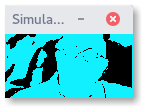

# Esther

Image export for microcontrollers with [floyd-steinberg dithering](https://en.wikipedia.org/wiki/Floyd–Steinberg_dithering). Compatible with [Adafruit-GFX-Libary](https://github.com/adafruit/Adafruit-GFX-Library) and [SSD1306-AVR](https://github.com/tibounise/SSD1306-AVR) bitmap formats.

## Compilation

Requires [LibGD](http://libgd.github.io). To compile, simply do :

```
cd src/
make
```

## Usage

```
esther myImage.png
```

If dithering annoys you, you can disable it :

```
esther -d myImage.jpg
```

## Examples

**Original image** | **No dithering** | **With dithering**
-------------------|------------------|-------------------
||
